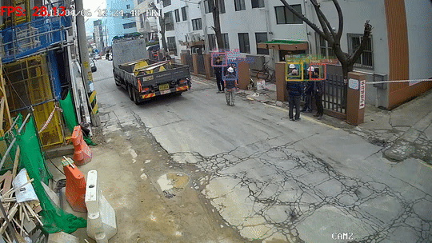

# Yolov4-deepsort-helmet-detection
[](https://hits.seeyoufarm.com)

helmet(hard hat) detector trained with [darknet framework](https://github.com/AlexeyAB/darknet) YOLOv4 model.

## tested environment
- `Windows 10 x64 2020 (build 19041.388)`
- `NVIDIA RTX 2070 Super`
- `CUDA 10.1 / CuDNN 7.6.5`
- `Python 3.7.7 x64`
- `tensorflow 2.2.0 GPU`

---

## trained weight
- [Google Drive](https://drive.google.com/file/d/1uOWZGx1oR1bRwp_mnvxobaXZcWs1X9ar)
    - put weight file in `./configs`
- **To train with your own datasets, You should do yourself with [darknet](https://github.com/AlexeyAB/darknet). And need to change some parameters**


## used dataset
- [roboflow.ai public dataset](https://public.roboflow.ai/object-detection/hard-hat-workers) \+ about 100 images

---

## dependencies
- python
    - opencv-python, numpy, scikit-image
        - to draw boxes and texts on image
    - tensorflow 2.2.0
        - to track object with DeepSORT model
    - matplotlib
        - to create color map
- CUDA 10.1 / CuDNN 7.6.5
- darknet
    - **for yolov4 object detection**
    - `dark.dll, pthreadVC2.dll (windows)`
        - Pre-Compiled (I'm not sure if it works on different machine)- [Google Drive](https://drive.google.com/file/d/1D3bYPyGgWUZavLsDh5SyU0yyPqW-5xiC)
    - `libdarknet.so (linux)`


## prepare environment and run
```python
pip install -r requirements.txt
```

```python
python detectandtrack.py
```
***you should modify code to make change***


## example

---

## citation
https://github.com/AlexeyAB/darknet

https://github.com/theAIGuysCode/yolov3_deepsort

https://public.roboflow.ai/object-detection/hard-hat-workers
